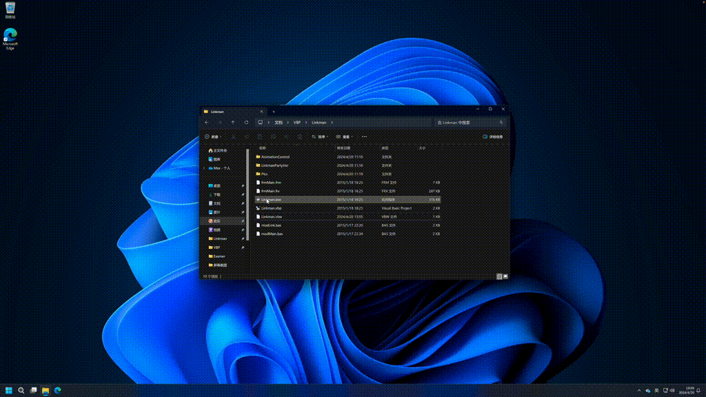

# Linkman

A network connector for PCs in my high school, completed in January 2015.

一个适用于我高中教室里电子白板的自动联网程序, 完成于 2015 年一月 (大概高二).

我们高中最开始是有校园网的, 而且在物理层上, 教室里的所有电脑和校园网都是通着的. 但是, 所有电脑都没有配置网络, 包括 IP 地址之类的. 这个程序启动后可以随机生成一个没被占用的 IP, 然后自动配置网络, 让教室里的电脑能上网, 相当于手动 DHCP.

其实这个程序不应该叫 link 啥啥啥的, 应该叫 connect 啥啥啥. 英语水平不是很好.

这个程序比较有趣的一点是, 它没有用那种很常见的弹一个窗口然后显示点什么提示文本的设计, 而是用了一个很酷炫的全屏非线性动画 + 淡入淡出, 类似这样:

实现动画的代码其实还挺简单的, 我之前把它们封装成了类, 以后需要用到这些动画效果的程序直接调用就行了. 虽然, 此后我就很少用 VB6 写程序了, 很遗憾.

## Copyright and License

Copyright (C) 2015 MaxXSoft (MaxXing). License GPLv3.
